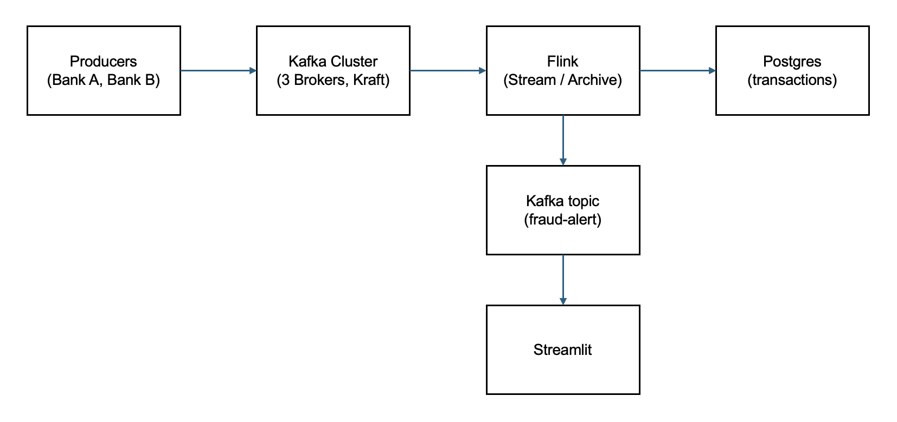

# Real-Time Fraud Detection System

A scalable, distributed real-time fraud detection system built with Apache Kafka, Apache Flink, PostgreSQL, and Streamlit. The system processes transaction streams from multiple banks, applies fraud detection rules, and provides real-time monitoring through an interactive dashboard.

---

## 📊 Architecture Overview



**Data Flow:**
1. Producers (Bank A, Bank B) generate transactions and send them to the Kafka cluster.
2. Kafka brokers store and replicate transaction streams.
3. Flink consumes transactions from Kafka:
   - Archives all transactions to PostgreSQL.
   - Detects fraud and publishes alerts to the `fraud-alerts` Kafka topic.
4. Streamlit dashboard consumes fraud alerts from Kafka and displays real-time analytics.

## 🏗️ System Components

### 1. **Kafka Cluster (KRaft Mode)**
**Purpose**: Distributed message broker for high-throughput transaction streaming

**Architecture**:
- **3 Kafka Brokers** (`kafka-1`, `kafka-2`, `kafka-3`)
  - Store and serve transaction data - brokers work together to ensure data is available, durable and distributed
  - Provide fault tolerance through replication
  - Each exposed on ports: 9092, 9093, 9094
  - Each listens on port 9092 inside its own isolated container
  - KAFKA_PROCESS_ROLES: broker — they only broker messages
  - Each has its own persistent volume (kafka_1_data, kafka_2_data, kafka_3_data)
  - Think of Kafka Broker as databases (DEV/TEST/PROD) -> Partitions as Schemas and Topics as Tables where these are replicated across Brokers
  - Replication is generally 3 -> 3 copies of partitions are found in different brokers (e.g. 3 on 3 brokers)
  - Always have 1 Leader and rest follower. Leader read/write, follower back ups data from Leader
  
- **1 Kafka Controller** 
  - Manages cluster metadata and leader elections
  - Replaces ZooKeeper in KRaft mode (much faster with simpler deployment, improved scalability, more efficient metadata)
  - KRaft stores cluster metadata like cluster membership, controller election, topics configuration, access control lists etc.in a single partition Kafka topic called `__cluster_metadata`
   - KRaft uses this to synchronise cluster state changes across controller and broker nodes
   - Active controller (leader of brokers) writes metadata change records to `__cluster_metadata`, controllers (followers) replicate topic events
  - Listens on ports 9093, 9094, 9095 inside its container (for broker communication)
  - Exposed on port 19093, 19094, 19095
  - KAFKA_PROCESS_ROLES: controller — only manages, doesn't broker
  - Has its own volume (kafka_controller_data)

**Topics**:
- `transactions` (3 partitions, replication factor: 3) - Raw transaction stream
- `fraud-alerts` (3 partitions, replication factor: 3) - Detected fraud events
- A topic may have more than 1 partition but 1 partition always belongs to a single topic

**Messages**:
- Messages in a single topic are distributed (spread) across its partitions using a partitioning strategy (default: hash of the message key modulo number of partitions; if no key → sticky/round-robin in modern Kafka).
- A single message exists in exactly one partition (no duplication within the topic itself).

- Each partition is replicated across multiple brokers (replication factor, typically 3).
- One replica is the leader (handles all producer writes and consumer reads); the others are followers that replicate from the leader.
- If the broker hosting the leader fails/dies, the Kafka controller (in KRaft mode) or controller broker (older ZooKeeper mode) automatically elects a new leader from the in-sync replicas (ISR) — i.e., one of the follower replicas that was fully caught up.
- The new leader broker then takes over reads/writes for that partition, and clients (producers/consumers) are redirected via updated metadata.

**Rationale**: 
- KRaft mode eliminates ZooKeeper dependency, simplifying operations
- 3-broker setup provides high availability and fault tolerance
- Partitioning enables horizontal scaling for high-volume transaction processing

**Features**
#### 1. How Kafka handles high throughput
Kafka handles high throughput (often millions of messages per second on modest hardware) through a combination of smart architectural choices that optimize for sequential I/O, parallelism, and minimal overhead. The key mechanisms you mentioned — partitioned logs, distributed brokers, consumer groups, and sequential writes — are central to this. Here's how they work together:
1. Partitioned Logs (Core to Parallelism & Scalability)

Every topic is divided into multiple partitions, each acting as an independent, ordered, append-only log.
This partitioning spreads the data load: producers can write to different partitions concurrently, and the system avoids a single bottleneck.
More partitions = more parallelism → higher overall throughput for both writes (from producers) and reads (from consumers).
Partitions enable horizontal scaling: add more partitions to a topic (or more topics) to handle growing volume without redesign.

2. Distributed Brokers (Horizontal Scaling & Load Distribution)

Partitions are distributed across multiple brokers in the cluster (e.g., one broker might lead several partitions, another leads others).
This distributes write and read traffic across many machines → no single broker becomes overwhelmed.
Brokers can be added dynamically to the cluster → throughput scales linearly with cluster size (add nodes → more CPU, disk, network capacity).
Replication (across brokers) ensures fault tolerance without sacrificing performance — followers replicate sequentially from leaders.

3. Consumer Groups (Parallel Consumption)

Consumers in the same consumer group share the work: Kafka assigns each partition to exactly one consumer in the group.
Multiple consumers → partitions processed in parallel → dramatically higher consumption throughput.
Fault tolerance - if one consumer is down, Kafka will assign another consumer to read from the missed topic
If you need even more read throughput (e.g., multiple downstream systems), use different consumer groups — each gets its own independent full stream.
This model allows fan-out at scale: one write can feed many parallel consumers without duplicating effort on the broker side.

4. Sequential Writes (The Performance Secret Sauce)

Kafka treats partitions as immutable append-only logs: new messages are always appended to the end (sequential disk writes).
Sequential I/O is orders of magnitude faster than random I/O on both HDDs and SSDs (no seeking → sustained high bandwidth).
Kafka leverages OS page cache heavily: writes go to cache first (fast), and the OS flushes them efficiently in the background.
Additional optimizations amplify this:
Zero-copy transfers: data moves directly from disk → network socket (no unnecessary copies in user space → less CPU).
Batching: producers batch messages (configurable via batch.size / linger.ms) → fewer network requests and larger sequential writes.
Efficient protocol: pull-based consumers fetch large chunks → reduces overhead.

#### 2. Exactly Once Semantics (EOS)
Exactly Once Semantics (EOS) in an Apache Kafka producer setting that ensures that each message produced to a Kafka topic is delivered exactly once, without duplication or loss.

This guarantees that even in the face of network failures or retries, Kafka will handle the producer's messages in such a way that they are neither duplicated nor missed.

To achieve this, the Kafka producer is configured to enable idempotence, meaning it assigns a unique sequence number to each message. If a message is sent more than once due to a failure or retry, Kafka will recognize it and discard the duplicate.

In addition, the Kafka consumer guarantees that the messages are processed exactly once by ensuring that offsets are committed only when a message has been successfully consumed.

NOTE: This combination of producer idempotence and consumer offset management ensures that Kafka provides strong delivery guarantees, making it ideal for use cases where message accuracy is critical, such as financial transactions or logging.

### 2. **Transaction Producers**
**Purpose**: Simulate real-world transaction generation from multiple banks

**Components**:
- **Bank A Producer**: Generates 50 transactions/second (users 1000-4999)
- **Bank B Producer**: Generates 30 transactions/second (users 5000-9999)

**Transaction Data Example**:
```json
{
  "transaction_id": "uuid",
  "bank_id": "BANK_A|BANK_B",
  "payment_system": "VISA|MasterCard|AMEX",
  "card_number": "4###############",
  "user_id": 1000-9999,
  "amount": 1.0-10000.0,
  "currency": "USD",
  "merchant": "Company Name",
  "country": "ISO Country Code",
  "timestamp": "2025-12-16T10:30:45+00:00"
}
```

**Rationale**:
- Realistic transaction patterns for testing fraud detection rules
- Configurable TPS allows load testing
- Easily scalable to add more banks/payment channels

---
### 3. **Apache Flink**
It processes data continuously as it arrives (true streaming, not micro-batching), with in-memory speed, high throughput, low latency, and strong correctness guarantees.
- Offers 3 APIs, Data Stream API (real-time stream processing), Data Set API (batch processing, large dataset), Flink SQL (write SQL to process both real-time and batch) where Flink SQL allows built-in function, create tables and run queries (time window, joins, aggregation)
- Data is processed in parallel across multiple machines

Components
- Source: where data enters Flink
- Operator: Processes data (transformation, joins) 
- Checkpoint: used for fault tolerance and recovery via storing state
- Sink: Final destination (e.g. databases, dashboard)

---

### 4. **PostgreSQL**
- Flink jobs consume transactions from Kafka, archive to PostgreSQL, and detect fraud.
- Fraud alerts are published to the `fraud-alerts` topic.

---

### 5. **Streamlit Dashboard**
- Consumes fraud alerts from Kafka and displays real-time analytics and transaction metrics.

---

## 🚀 Quickstart

1. **Start Docker Compose**
   ```sh
   docker compose down -v && docker compose up -d
   ```

2. **Create Topics (if needed)**
   ```sh
   docker exec -it kafka-1 /opt/kafka/bin/kafka-topics.sh --create --topic transactions --bootstrap-server localhost:9092 --partitions 3 --replication-factor 3
   docker exec -it kafka-1 /opt/kafka/bin/kafka-topics.sh --create --topic fraud-alerts --bootstrap-server localhost:9092 --partitions 3 --replication-factor 3
   ```

3. **Start Producers**
   ```sh
   docker compose up -d --build app-producer-bank-a app-producer-bank-b
   ```

4. **Start Flink and PostgreSQL**
   ```sh
   docker compose up -d --build flink-jobmanager flink-taskmanager postgres
   ```

5. **Run Streamlit Dashboard**
   ```sh
   streamlit run dashboard/streamlit_app.py
   ```

---

## 📝 Next Steps

- For higher TPS, consider time-series DBs like InfluxDB.
- For advanced analytics, explore ClickHouse or DruidDB.

